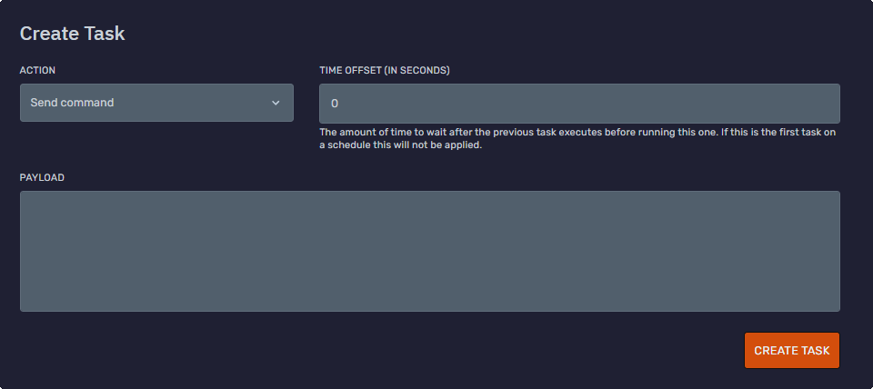

# Scheduling Actions

Hey there Bloomers! In this guide, we will go over scheduling actions to go off at predetermined times for your server. 

First, you want to go to your server panel and go to its sidebar. There, you will find a tab called Schedules. The number next to it shows how many schedules you have set up so far. 

Here is where all your schedules will be located in one convenient place. To add a new schedule, click the **Create New** button.

In the scheduling panel, there are 3 main sections of each schedule. Its name, the day it will go off and the time it will go off, and the action it will perform.

The name can be whatever you want it to be. It could be “Daily Restart”, “Tell Billy he is amazing!”, or “You are amazing!”.

The second section is when it will go off. Keep in mind all Bloom servers run on Universal Standard Time (UTC), so make sure your schedules reflect that. The day it will go off can either be the day of the month or the day of the week. So, if you want it to restart every Saturday, you could click Saturday. If you want it to restart twice per month, you may pick the first day and the 15th day of a month. Additionally, you can add a wildcard to it, which is *. This means that it will do it for every value. This is very useful if you want to do something repeatedly, like daily restarts.

The final section is what it will send as a command or as a power action. Commands should be used without the “/” in it and doesn’t accept variables. You could send a power action, which you can have turn off the server. If you use “stop”, the server will stop itself. Available power actions are:

Start - Starts up the server
Stop - Stops the server
Restart - Stops then start up the server
Kill - Kills the server (Not recommended!)

## Examples

“Daily Restart”

“Launch Day!”

“LoJoSho has to do something”

